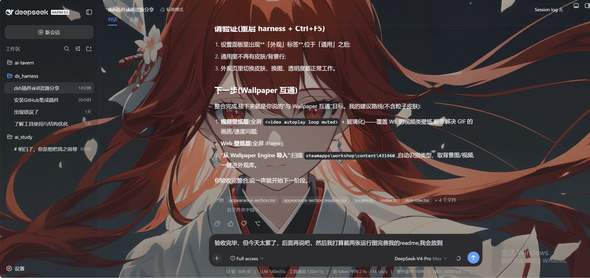

# dsh-skin-background

自定义背景皮肤:在 DeepSeek Harness Web GUI 里作为**一个皮肤选项**与「经典」「深海女仆」并列 —— 选中即生效,切走即还原。壁纸以静态底色铺满界面,侧边栏与底部为玻璃质感。



- **系统文件窗口选图**:点「选择图片并保存…」弹出系统原生「打开」对话框,选中的图片自动内嵌为 data URI 保存(离线可用、无需服务器);
- **保存库**:可随时「应用」历史图片或「删除」;
- **支持 GIF 动图**:动图作为背景会播放(静态图上限 4MB,动图上限 15MB);
- **静态壁纸底色**(maid-atelier 同款架构):一张 CSS 变量 + 注入样式表,`fixed` 视口锚定 —— 边栏开合、窗口缩放时壁纸纹丝不动;
- **玻璃侧边栏**:左右边栏与底部输入区半透明,壁纸透出(主题 token 重绑实现,深浅主题自动适配);
- **两个透明度滑杆**:
  - 「透明度」:图片本体压暗(0–100,100 = 满亮);
  - 「边栏透明度」:边栏玻璃通透度(0 = 实色,100 = 完全透明);
- **即时切换**:点「应用」像切皮肤一样瞬间生效,无需刷新;设置未就绪前不绘制,启动无闪烁;
- **完整还原**:切走皮肤时移除注入样式与变量,不留痕迹。

## 安装

```sh
dsh plugin --profile web add github:awfawafaf/dsh-skin-background
```

依赖同一个 profile 里的 `dsh-skin-manager`(皮肤管理器,提供「外观」设置页)。安装后**重启 dsh web**,然后在 设置 → **外观** → 「皮肤」选择「自定义背景」。

## 使用

1. 设置 → **外观** → 「皮肤」行选择「**自定义背景**」—— 立即生效(未保存图片时显示默认渐变);
2. 「背景」行点「选择图片并保存…」从系统文件窗口选图 —— 自动存入保存库并设为当前图;
3. 「已保存」列表可「应用」/「删除」;
4. 「透明度」压暗亮图;「边栏透明度」调节玻璃通透度 —— 拖动即时预览;
5. 切回「经典」或「深海女仆」即还原原皮肤外观。

## 数据模型

设置命名空间 `skin-background`(Host settings 文档):

```ts
interface BackgroundSettings {
  activeId: string        // 当前应用的已保存图片 id;空 = 默认渐变
  opacity: number         // 图片透明度 0–100(100 = 满亮)
  chromeOpacity: number   // 边栏玻璃透明度 0–100(0 = 实色,100 = 全透明)
  items: BackgroundItem[] // 保存库
}
interface BackgroundItem {
  id: string
  name: string            // 原文件名(仅显示)
  dataUrl: string         // 内嵌 data URI
}
```

皮肤激活状态本身由管理器持久化(`skin-manager.skin`)。

## 绘制方式

- 壁纸值写进 body 上的 CSS 变量 `--dsh-bg-art`,一张注入的 `<style>` 表把 `body`、`[data-phase='hero']`、`[data-phase='active']`、`[class*='frame']` 表面统一画上 `fixed + cover` 视口锚定背景 —— 表面挂载即生效,无 JS 重绘时序问题;
- 压暗通过 `--dsh-bg-veil-strength` 驱动的主题底色渐变蒙层实现;玻璃边栏通过重绑 `--dsw-specific-sidebar-fill` 令牌 + `--dsh-chrome-transparency` 变量实现;
- 切走皮肤时移除样式表与全部变量,完整还原。

## 开发

```sh
pnpm install
pnpm run typecheck && pnpm test && pnpm run build
```

产物:`lib/index.js`(host 半)+ `lib/client.js`(浏览器 bundle)+ `lib/types/`。`lib/` 提交进 git。

## 许可

MIT
